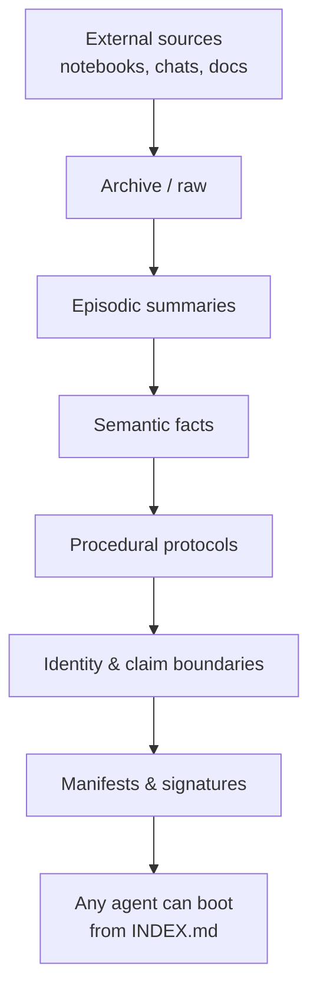

# Memory Index System

[](LICENSE)
[](https://www.python.org/)
[](.github/workflows/ci.yml)

The **Memory Index System** is a portable, human-readable, integrity-checked knowledge layer for long-running AI-assisted research and engineering projects.

It lets you hand a project from one agent to another without giving away hard-drive access, API keys, or chat history. The package is self-contained: an `INDEX`, a boot sequence, four durable memory layers, and cryptographic manifests.

---

## Why this exists

Long-running projects die when context is trapped inside a single chat, notebook, or human brain. This system makes context:

- **Portable** — zip the `.memory/` tree and give it to any agent.
- **Human-readable** — Markdown and JSON first; no opaque embeddings as primary storage.
- **Integrity-checked** — SHA-256 manifests plus optional HMAC-SHA256 signing.
- **Honest by design** — claim boundaries, agent protocols, and falsification-first thinking are built in.

---

## Quick start

Try it with no install, using [pipx](https://pipx.pypa.io/):

```bash
pipx run --spec git+https://github.com/reedickulos/memory-index-system memory-index-init ./my-research-project
```

Or install it properly:

```bash
# Clone the repo
git clone https://github.com/reedickulos/memory-index-system.git
cd memory-index-system

# Install the CLI
pip install -e .

# Optional: set a signing key *before* init, so the tree is signed from the start
export MEMORY_INDEX_KEY="your-secret"

# Scaffold a memory tree in your project
memory-index-init ./my-research-project

# Verify integrity
memory-index-verify ./my-research-project/.memory

# Re-sign after edits (signed if MEMORY_INDEX_KEY is set). A tree created
# without a key needs --adopt-unsigned the first time it's signed with one.
memory-index-sign ./my-research-project/.memory

# Index every .memory/ tree under a directory into a local, cross-project registry
memory-index-registry-scan ~/projects --save-roots
memory-index-registry-list
memory-index-registry-search "ledger continuity"

# See what changed in a project's identity files since the last scan
memory-index-registry-diff ./my-research-project/.memory
```

Your project now has a `.memory/` directory:

```text
my-research-project/
└── .memory/
    ├── INDEX.md
    ├── manifests/
    │   ├── manifest.json
    │   └── initiation-order.json
    ├── episodic/
    ├── semantic/
    ├── procedural/
    ├── identity/
    └── scripts/
```

---

## The four memory layers

| Layer | Purpose | Example content |
|---|---|---|
| `episodic/` | Dated session events and narratives | `2026-06-19-ledger-session.md` |
| `semantic/` | Durable facts, hypotheses, architecture | `causal-operator-contract.md` |
| `procedural/` | Operating instructions for agents | `agent-handoff-protocol.md` |
| `identity/` | Project charter, values, claim boundaries | `project-charter.md` |

Plus `manifests/` for integrity and `scripts/` for automation.

---

## Cross-project registry

A single project's `.memory/` tree answers "what does this project know?" The
registry answers "what projects exist, and which one has what I need?" —
useful before starting work in an unfamiliar project, or when picking up
where a different agent left off elsewhere on disk.

`memory-index-registry-scan` walks one or more directories, finds every
initialized `.memory/` tree (one with a `manifests/manifest.json`), and
writes a local index to `~/.memory-registry/registry.json`. Each entry holds
only what the project's `identity/` layer already publishes — its charter,
its claim boundary, and a hash of its manifest — never the contents of
`episodic/`, `semantic/`, or `procedural/`. `--save-roots` remembers the
scanned directories in `~/.memory-registry/scan-roots.json` so a later
`memory-index-registry-scan` with no arguments rescans the same places.

See [Registry Spec](docs/registry-spec.md) for the schema.

---

## Architecture



---

## What makes it safe

- **Claim boundaries** live in `identity/claim-boundary.md`. Agents must enforce them.
- **Boot sequence** in `manifests/initiation-order.json` forces orientation before action.
- **Manifests** detect tampering or accidental drift.
- **Safety-first by design** — traceability and falsifiability are structural, not afterthoughts.

---

## Documentation

- [Protocol (v1)](docs/PROTOCOL.md) — what makes a `.memory/` tree or another tool compatible with this one, independent of language or implementation
- [Protocol v2](docs/PROTOCOL-v2.md) — current signing format (covers `revision` and a new `tree_id`); a delta on v1, not a replacement
- [Overview](docs/overview.md)
- [Architecture](docs/architecture.md)
- [Agent Protocol](docs/agent-protocol.md)
- [Manifest Spec](docs/manifest-spec.md)
- [Registry Spec](docs/registry-spec.md)
- [FAQ](docs/faq.md)
- [Changelog](CHANGELOG.md)
- [Contributing](CONTRIBUTING.md)

---

## Contributing

We welcome contributions that improve portability, integrity, and alignment. See [CONTRIBUTING.md](CONTRIBUTING.md) and [CODE_OF_CONDUCT.md](CODE_OF_CONDUCT.md).

---

## License

[MIT](LICENSE) — © 2026 COREPACT AI TECHNOLOGIES.

---

## About


Memory Index System is **A COREPACT AI TECHNOLOGIES Project — ALIGNED BY DESIGN**, meaning human safety, traceability, and falsifiability come first. *COREPACT — CONSENSUS Orchestration Reasoning Engine Protocol for Artificial Collaborative Think-tank.*
