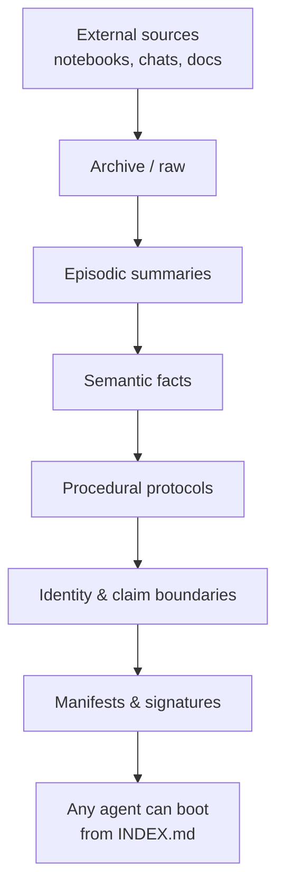

# Memory Index System

> **CORE-LAB — A DIVISION OF COREPACT AI TECHNOLOGIES**  
> **ALIGNED BY DESIGN**  
> *Human-safety alignment is the first principle.*

[](LICENSE)
[](https://www.python.org/)
[](.github/workflows/ci.yml)

The **Memory Index System** is a portable, human-readable, integrity-checked knowledge layer for long-running AI-assisted research and engineering projects.

It lets you hand a project from one agent to another without giving away hard-drive access, API keys, or chat history. The package is self-contained: an `INDEX`, a boot sequence, four durable memory layers, and cryptographic manifests.

---

## Why this exists

Long-running projects die when context is trapped inside a single chat, notebook, or human brain. This system makes context:

- **Portable** — zip the `.memory/` tree and give it to any agent.
- **Human-readable** — Markdown and JSON first; no opaque embeddings as primary storage.
- **Integrity-checked** — SHA-256 manifests plus optional HMAC-SHA256 signing.
- **Honest by design** — claim boundaries, agent protocols, and falsification-first thinking are built in.

---

## Quick start

```bash
# Clone the repo
git clone https://github.com/reedickulos/memory-index-system.git
cd memory-index-system

# Install the CLI
pip install -e .

# Scaffold a memory tree in your project
memory-index-init ./my-research-project

# Verify integrity
memory-index-verify ./my-research-project/.memory

# Re-sign after edits (requires KIMI_MEMORY_KEY env var)
memory-index-sign ./my-research-project/.memory
```

Your project now has a `.memory/` directory:

```text
my-research-project/
└── .memory/
    ├── INDEX.md
    ├── manifests/
    │   ├── manifest.json
    │   └── initiation-order.json
    ├── episodic/
    ├── semantic/
    ├── procedural/
    ├── identity/
    └── scripts/
```

---

## The four memory layers

| Layer | Purpose | Example content |
|---|---|---|
| `episodic/` | Dated session events and narratives | `2026-06-19-ledger-session.md` |
| `semantic/` | Durable facts, hypotheses, architecture | `causal-operator-contract.md` |
| `procedural/` | Operating instructions for agents | `agent-handoff-protocol.md` |
| `identity/` | Project charter, values, claim boundaries | `project-charter.md` |

Plus `manifests/` for integrity and `scripts/` for automation.

---

## Architecture



---

## What makes it safe

- **Claim boundaries** live in `identity/claim-boundary.md`. Agents must enforce them.
- **Boot sequence** in `manifests/initiation-order.json` forces orientation before action.
- **Manifests** detect tampering or accidental drift.
- **ALIGNED BY DESIGN** means human safety, traceability, and falsifiability are first-class, not afterthoughts.

---

## Documentation

- [Overview](docs/overview.md)
- [Architecture](docs/architecture.md)
- [Agent Protocol](docs/agent-protocol.md)
- [Manifest Spec](docs/manifest-spec.md)
- [FAQ](docs/faq.md)
- [Contributing](CONTRIBUTING.md)

---

## Contributing

We welcome contributions that improve portability, integrity, and alignment. See [CONTRIBUTING.md](CONTRIBUTING.md) and [CODE_OF_CONDUCT.md](CODE_OF_CONDUCT.md).

---

## License

[MIT](LICENSE) — © 2026 COREPACT AI TECHNOLOGIES.

---

> *COREPACT — CONSENSUS Orchestration Reasoning Engine Protocol for Artificial Collaborative Think-tank.*  
> *CORE-LAB — A DIVISION OF COREPACT AI TECHNOLOGIES.*  
> **ALIGNED BY DESIGN.**
